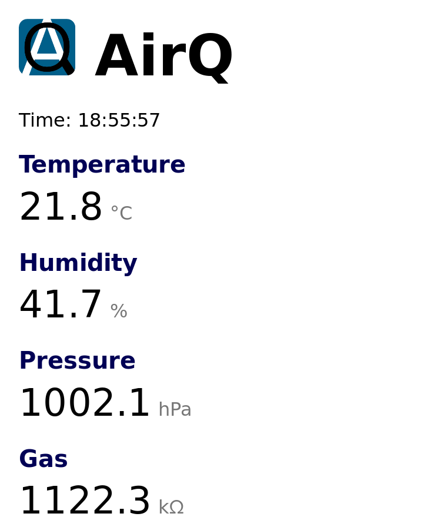

# AirQuality

Monitor your AirQuality with an [ESP8266](https://www.espressif.com) and a [BME680](https://www.bosch-sensortec.com/bst/products/all_products/bme680). The BME680 sensor measures temperature, humitidy, air pressure, and gas concentration. The ESP8266 serves this sensor data as a website and keeps the data up-to-date over a websocket. The current time is fetched using the Network Time Protocol (NTP) and is shown in UTC.

## Requirements
### Hardware
- ESP8266
- BME680

### Software
- [Arduino IDE](https://www.arduino.cc/) or [Arduino CLI](https://github.com/arduino/arduino-cli)
- Arduino library: [WebSocket Server and Client](https://github.com/Links2004/arduinoWebSockets/)
- `xxd` to create C-files from static data
- *Optional:* [screen](https://www.gnu.org/software/screen/) to show serial output

## Usage
1. Connect the ESP8266 with the BME680 over I2C. You can set SDA and SCL pins in `AirQuality.ino` with the defines `I2C_SDA` and `I2C_CLK`.
2. Set your WIFI credentials in `wifi_credentials.h`.
3. Flash the firmware to the ESP8266 using `make.sh`.
4. Enter the IP of your ESP8266 in your mobile or desktop browser.

## Licenses
- `AirQuality.ino`, `ESP8266NTP.[h/cpp]`, `static/index.html`, and `static/manifest.webmanifest` are licensed under the [ISC license](LICENSE-ISC.md).
- `bme680_defs.h` and `bme680.[c/h]` from [Bosch Sensortec GmbH](https://www.bosch-sensortec.com) include their license in their header.
- `Adafruit_BME680.[h/cpp]` from [Adafruit Industries](https://github.com/adafruit/Adafruit_BME680) are licensed under the [BSD license](https://en.wikipedia.org/wiki/BSD_licenses).
- `Adafruit_Sensor.h` from [Adafruit Industries](https://github.com/adafruit/Adafruit_Sensor) is licensed under the [Apache license 2.0](http://www.apache.org/licenses/LICENSE-2.0).
